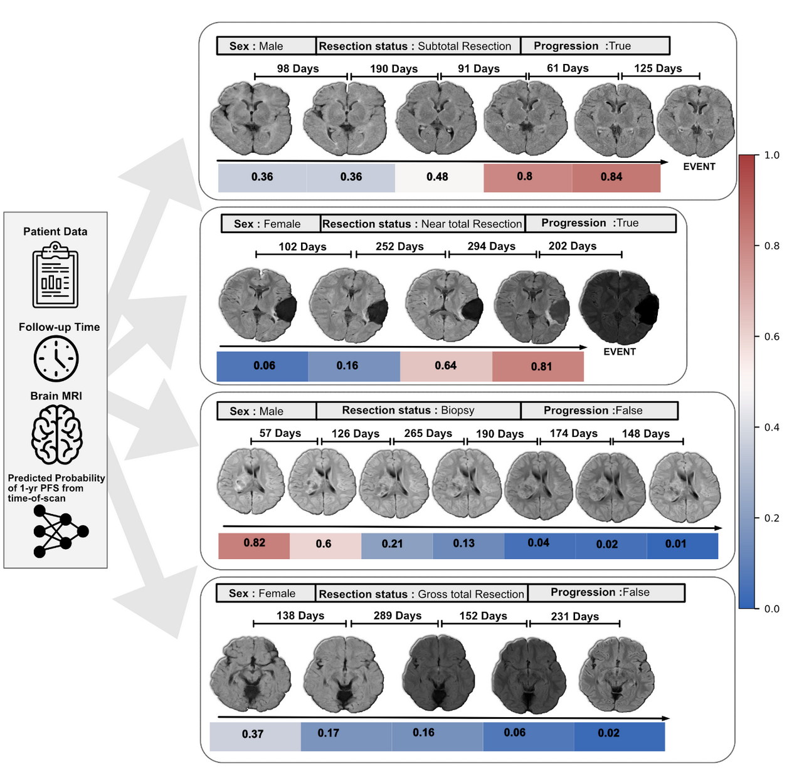

# BRAF Subtype Mutation CLassification 
> This repository contains the implementation of the longitudinal pediatric glioma EFS pipeline from paper [[link here](https://www.medrxiv.org/content/10.1101/2024.06.04.24308434v1.full-text)]  .




---

## Table of Contents
- [Installation](#installation)
- [Usage](#usage)
   - [Data setup](#data-setup)
    - [Preprocessing](#preprocessing)
    - [Dataset setup](#dataset-setup)
    - [Temporal Learning](#temporal-learning)
    - [Training](#training)
    - [Inference](#inference)
    - [Intrapatient Analysis](#intrapatient-analysis)
---

## Installation
The project works on virtual anaconda environment.
Use this command for installing the anaconda environment for the segmentation code
```shell
conda env create -f environment.yml
```


## Usage 

### Data setup
The pipeline works on nifti images (.nii.gz, .nii) for brain MRs. Move the images into the "preprocessed_datadir" folder. 
The image names must be formated in the form of "patientID_Scandate.nii.gz" where the scandate is in YYYYMMDD format , for example : 547531_20040101.nii.gz.

### Preprocessing 
Once images, are moved to the data directory they can be preprocessed (N4 bias field correction, MNI template registration, Z4 score normalization)
To run preprocessing, first move the MNI template for image registration to the "mni_template" folder. The age specific templates can be found [[here](https://nist.mni.mcgill.ca/pediatric-atlases-4-5-18-5y/)] 
Then run the command 
```shell 
python mri_preprocess_3d.py /mnt_template/temp_head.nii.gz
```
The preprocessed images will be stored in "processed_datadir/nnunet/imagesTs/"

### Dataset setup 
The dataset is loaded using a csv with columns [pat_id,scandate,label]. where scandate is a list of multiple scans for same subject collated into one string, and label is the 1year event prediction (binary)
a sample row of this csv looks like this :

| pat_id | scandate | label |
|---------|---------|---------|
| 458545  | 20040101-20050101-20060101-20070101  | 1  |

To create the longitudinal csv from the dataset run :
```shell 
python create_longitudinalcsv.py --directory_path /processed_datadir/nnunet/imagesTs/ --output_csv /csvs/longitudinal.csv --labels /path/to/list_of_labels
```
The longitudinal csv, can further be split into train,val,test csvs 
```python 
import pandas as pd
from sklearn.model_selection import train_test_split

df = pd.read_csv('/csvs/longitudinal.csv')
train_val, test = train_test_split(df, test_size=0.2, random_state=42)
train, val = train_test_split(train_val, test_size=0.25, random_state=42)

# Save splits 
train.to_csv('/csvs/longitudinal_train.csv', index=False)
val.to_csv('/csvs/longitudinal_val.csv', index=False)
test.to_csv('/csvs/longitudinal_test.csv', index=False)
```

### Temporal Learning 
To train temporal learning, create the temporal learning oversampled csvs by :
```shell
python create_tl_csvs.py --input_path /csvs/longitudinal_csv.py --output_path /csvs/tl_train.csv
```

### Training 
The training parameters, and csv paths can be specified in the config.yml file. 
To train the temporal learning or finetuning for EFS run :
```shell
python train.py
```

### Inference
Specify the model checkpoints for testing/inference in the config.yml file. Then run :
```shell
python infer.py
```

### Intrapatient Analysis 
To perform intrapatient analysis run snippets from intrapatient_analysis.ipynb notebook

